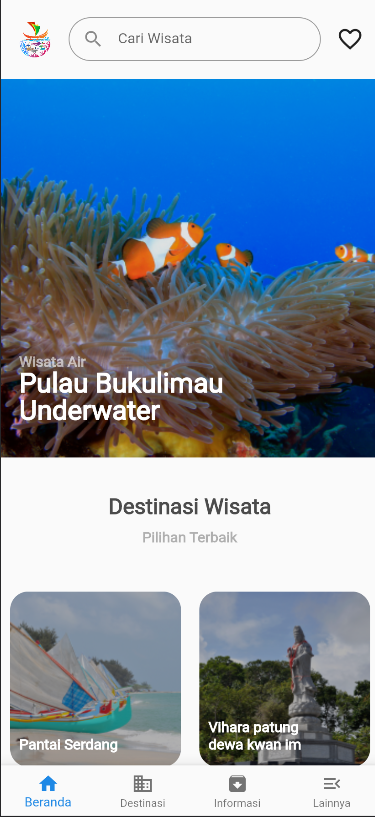
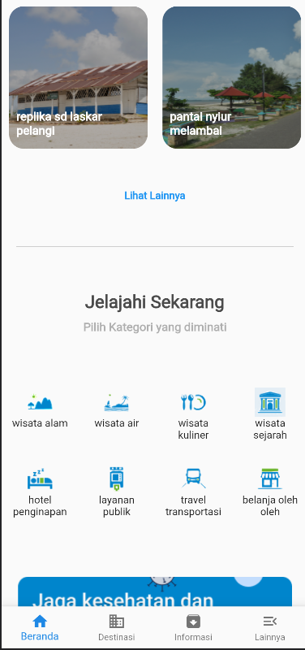

# salinan_home_page_figma

implement figma design home page

src:

- https://www.figma.com/file/eAwW6mNAcReUSML1VaKhIE/Project-Latihan-Kelas-Pemrograman-Mobile?node-id=0-1&t=b44PiRxHsl1XaiJz-0

## images

  
   
  

